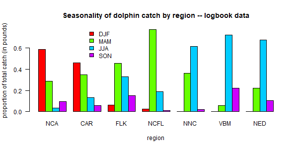
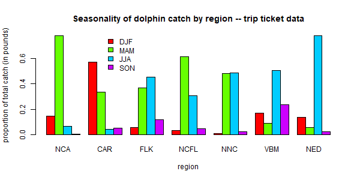

# NOAA Fisheries commercial data

We do not display the commercial data analysis here because it is based on logbook reporting and trip ticket databases, which both contain confidential data. The code for processing the commercial data can be seen in the file “commercial.R” and the steps are outlined below.

## Analysis of logbook data

We first use the pelagic longline logbook data to understand how the fleet operates in the high seas on a seasonal basis. These numbers are used later to estimate the seasonality of the international landings, because those are only reported on an annual basis but quarterly values are needed.

The steps are as follows: 1. Read in the pelagic longline data which contains set level entries including location of fishing, target species, gear used, other details of the fishing trip and number of dolphin caught, discarded alive, discarded dead, and the total pounds of dolphin kept. 2. Format the longitude and latitude of the sets into decimal degrees, and find the points that fall within each of the seven polygons representing the areas of the operating model. Check that subsetting was done correctly and add and area identifier. 3. Look at the characteristics of the dolphin catch and calculate the discard rates by trip. Dead discarding rate is found to be 1.4% on average and total discard rate is 2.9% on average. 4. Standardize date formatting and add identifier for season (quarter). Specify a new year variable to allow December to be grouped with January and February. 5. Summarize the total dolphin catch (in pounds) by year, quarter, and area. 6. Convert the total pounds by year-quarter and area to proportions such that each year-quarter combination has four seasonal proportions summing to 1. Save the matrix of proportions for later analysis.

## Analysis of trip ticket data

Not all of the commercial dolphin catch activity is reported in the logbooks because dolphin are targeted via a variety of permits and gear types, not all of which have the same reporting requirements. Therefore, in order to parse the commercial catches by year, area and quarter, we use the commercial trip ticket data compiled by NOAA Fisheries. These are the same data used for quota monitoring and thus are the best representation of the total catch.

The steps are as follows: 1. Read in the trip ticket data file, which contains commercial dolphinfish landings for the Atlantic coast from 1986-2023, including all landings by year even if the gear type or area is unknown. The dataset specifies the year and month of landing, an area of fishing, gear, and the state where landed. Pounds are in units of whole weight. 2. Read in operating model regions and classify the list of logbook areas into those seven regions. Assign each reported area to an operating model region accordingly. 3. Standardize date formatting and add identifier for season (quarter). Specify a new year variable to allow December to be grouped with January and February. 4. Summarize the landings by year-quarter, gear (PLL gear vs. other gears) and region. 5. For most combinations of year-quarter, region and gear, there are substantial landings for which the area of fishing is unknown and therefore the region cannot be defined. We assume that those landings follow the same distribution with regard to region as the other landings for that year-quarter and gear combination. For each year-quarter/gear combination, we calculate the proportion of catch that occurs in each of the seven regions. The total landings of unknown regions are multiplied by those proportions and then added to the landings from known regions. In cases where none of the areas are known for that year-quarter/gear combination, proportions from the quarter immediately previous to that quarter are used. Sum the landings by gear type to get the total landings for each year-quarter and region. 6. Reformat the data according to the specifications needed for input to the operating model (columns specifying the year, quarter, fleet, area and total catch). 7. Sum landings by year from the original data file and the final outputs to ensure that data were processed correctly and no catch is missing.

