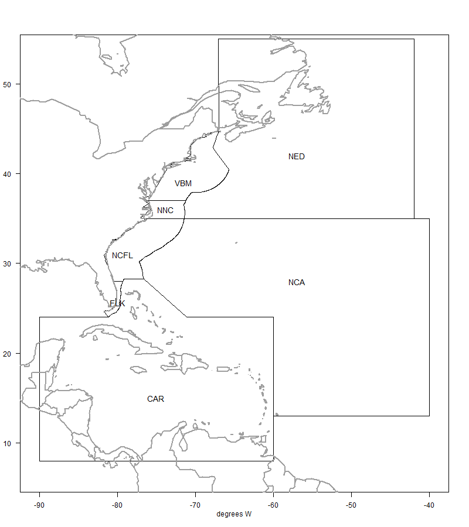

# Data compilation for all fleets in the operating model

In this last step we will compile all of the output data files from the different data sources (NMFS commercial trip tickets, NMFS recreational statistics, Sea Around Us) and check the files for accuracy.

Recall that there are seven defined areas in the operating model, over which the landings are summed. Four of these areas are within the U.S. EEZ and the other three areas are international waters (high seas and jurisdictional waters of other countries).



## Data upload

First we access all of the final data files from the previous steps.

```{r}
#| echo: true

# clear workspace
rm(list = ls())

# view data files in directory
dir("data/FINAL_files/")

intc <- read.csv("data/FINAL_files/CAR_Intl_unrep_TomFormat.csv")
intn <- read.csv("data/FINAL_files/NCA_Intl_TomFormat.csv")
intw <- read.csv("data/FINAL_files/NED_Intl_TomFormat.csv")
com <- read.csv("data/FINAL_files/commercial_TomFormat.csv")
rec <- read.csv("data/FINAL_files/rec_catch_TomFormat.csv")
```

This file contains all international landings and unreported catches for the greater Caribbean region (jurisdictional waters of all countries). Recall that estimated discards were very small (\< 1%) and were removed from the summary.

```{r}
#| echo: true
apply(intc[1:4], 2, table, useNA = "always")
```

This file contains all international landings for the NCA region (i.e., FAO region 31), also known as the Western Central Atlantic. There are no territorial waters in this area (except for Bermuda, which as discussed previously is summarized with the CAR region) and there are no unreported catches or discards in the database.

```{r}
#| echo: true
apply(intn[1:4], 2, table, useNA = "always")
```

This file contains all international landings for the NED region (i.e., FAO region 21), also known as the Northwest Atlantic. This includes NED high seas landings, as well as landings from Canadian and French territorial waters which fall in this region. There are no unreported catches or discards for this region in the database.

```{r}
#| echo: true
apply(intw[1:4], 2, table, useNA = "always")
```

This file contains all landings for the U.S. commercial fleet, including landings from U.S. EEZs and high seas. There are no unreported catches in this region. Recall that estimated dead discards were very small (\< 2%) and were removed from the summary.

```{r}
#| echo: true
apply(com[1:4], 2, table, useNA = "always")
```

This file contains all landings for the U.S. recreational fleet, which are all assumed to occur within the U.S. EEZs. There are no unreported catches in this region.

```{r}
#| echo: true
apply(rec[1:4], 2, table, useNA = "always")
```

Now we combine the data files and create some figures with the final composite data file.

```{r}
#| echo: true
d <- rbind(intc, intn, intw, com, rec)

# how many rows contain zeros 
#hist(d$Catch_lbs)
table(d$Catch_lbs == 0)

# resort levels geographically
d$Area <- factor(d$Area, levels = c("NCA", "CAR", "FLK", "NCFL", "NNC", "VBM", "NED"))
d$Fleet <- factor(d$Fleet, levels = c("Rec", "Hire", "UScom", "Intl", "UnRep"))
```

## Visualizing the final data set

We plot the final data set in a number of different ways to detect any errors that may have occurred during processing.

```{r}
#| echo: true
#| fig-width: 9

# plot the total landings by each factor
par(mfrow = c(2, 2), mex = 0.7)
barplot(tapply(d$Catch_lbs, d$Year, sum, na.rm = T)/10^6, las = 2,
        main = "Total landings by year", ylab = "total landings (millions of pounds)")
barplot(tapply(d$Catch_lbs, d$Quarter, sum, na.rm = T)/10^6, 
        ylab = "total landings (millions of pounds)", main = "Total landings by quarter")
barplot(tapply(d$Catch_lbs, d$Fleet, sum, na.rm = T)/10^6, 
        main = "Total landings by fleet", ylab = "total landings (millions of pounds)")
barplot(tapply(d$Catch_lbs, d$Area, sum, na.rm = T)/10^6, 
        main = "Total landings by area", ylab = "total landings (millions of pounds)")
```

The total landings in the regions analyzed is highly variable but relatively stable over time with a slight decrease in recent years. Most of the landings are caught in quarter 2 (March - May). The largest sector is the U.S. private recreational sector, followed by international fleets (all types), the for-hire fleet and then the U.S. commercial fleet. Most of the fishing activity takes place in the Florida Keys and the Greater Caribbean, with other regions contributing much less.

```{r}
#| echo: true
#| fig-height: 4

par(mfrow = c(1, 1), mar = c(2, 5, 3, 1))
tab <- tapply(d$Catch_lbs, list(d$Fleet, d$Area), sum, na.rm = T)/10^6
barplot(tab, beside = T, col = c("navy", "blue", "darkturquoise", "red", "pink")
        , legend = rownames(tab),
        main = "Total dolphin landings by area and fleet", 
        ylab = "total landings (millions of pounds)")
```

As expected, U.S. recreational fishing (private and for-hire) only takes place in the four U.S. EEZ regions (FLK, NCFL, NNC and VBM). The U.S. commercial fishery operates largely in those four U.S. EEZ regions, with small amounts of landings in the high seas of NCA, CAR and NED regions. International landings occur largely in the Caribbean, with lesser amounts in the NCA and NED high seas regions.

```{r}
#| echo: true
tab <- tapply(d$Catch_lbs, list(d$Quarter, d$Area), sum, na.rm = T)/10^6
tabp <- apply(tab, 2, function(x) x / sum(x, na.rm = T))

par(mar = c(2, 4, 3, 1))
barplot(tabp, beside = T, col = rainbow(4, end = 0.8), 
        legend = c("winter (DJF)", "spring (MAM)", "summer (JJA)", "fall (SON)"), 
        args.legend = list(x = 15, y = 0.7, bty = "n"), 
        main = "Total dolphin landings by area and season", 
        ylab = "proportion of landings")
```

This plot shows the seasonal movements of dolphin across the different regions, as expressed through the proportion of landings that occurs in each quarter within each area. In the NCA and CAR regions, most of the landings occur in winter, whereas in the U.S. South Atlantic regions, most of the landings occur in spring and summer. In the U.S. Mid-Atlantic the landings also occur largely in spring, and also fall. In the NED region most of the landings occur in summer.

```{r}
#| echo: true

tab <- tapply(d$Catch_lbs, list(d$Year, d$Fleet), sum, na.rm = T)/10^6

par(mar = c(2, 4, 3, 1))
matplot(rownames(tab), tab, 
        col = c("navy", "blue", "darkturquoise", "red", "pink"), 
        type = "l", lwd = 2, lty = c(rep(1, 3), 2, 2), 
        main = "Total annual dolphin landings by fleet", xlab = "",
        ylab = "total landings (millions of pounds)")
legend(2002, 25, lwd = 2, lty = c(rep(1, 3), 2, 2), bty = "n", 
       c("U.S. private rec", "U.S. for-hire", "U.S. commercial", 
         "International", "Unreported"),
       col = c("navy", "blue", "darkturquoise", "red", "pink"))
```

This plot shows the time series of total annual dolphin landings by fleet. We can compare these figures with the plots from the previous chapters to ensure the data were processed correctly. The magnitude and variability of the landings match the expectations.

```{r}
#| echo: true

# output the final concatenated data file
write.csv(d, file = "data/FINAL_files/complete_catch_dataset_09052025b.csv", row.names = FALSE)


d1 <- d[which(d$Year == 2022), ]
d1$ar2 <- ""
d1$ar2[which(d1$Area == "FLK")] <- "S"
d1$ar2[which(d1$Area == "NCFL")] <- "S"
d1$ar2[which(d1$Area == "NNC")] <- "N"
d1$ar2[which(d1$Area == "VBM")] <- "N"
d1$cat <- paste0(d1$Fleet, d1$ar2)
d1$cat[which(d1$Fleet == "UScom")] <- "UScom"

round(tapply(d1$Catch_lbs, d1$cat, sum, na.rm = T)/10^6/2.205, 3)


```


